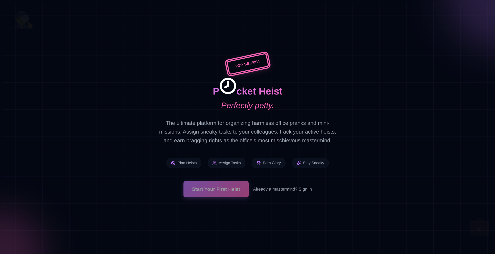
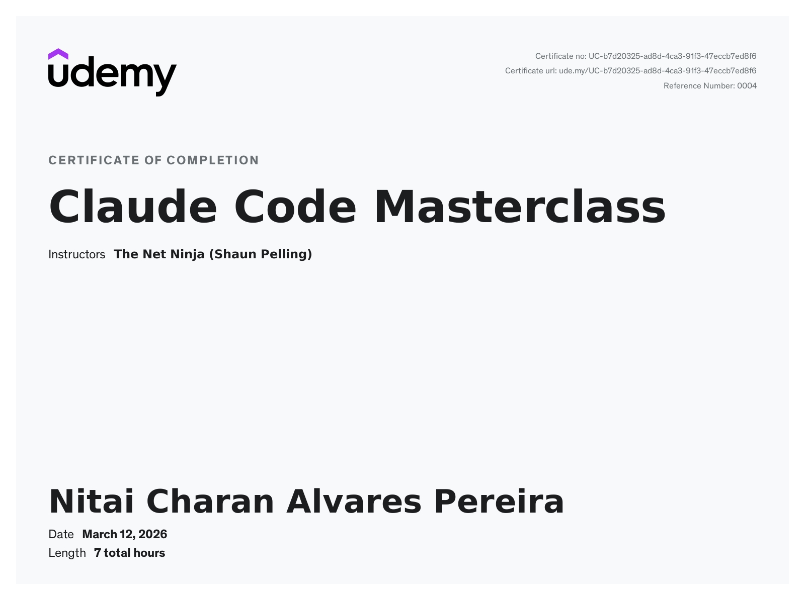

<!-- PROJECT SHIELDS -->

![Next.js][nextjs-shield]
![React][react-shield]
![TypeScript][typescript-shield]
![TailwindCSS][tailwind-shield]

<a href="https://www.udemy.com/course/claude-code-master-class/">
  <p align="center">
    
  </p>
</a>

## About project

This project was part of the Udemy course "Claude Code Master Class" by The Net Ninja (Shaun Pelling).

- [Course][course-url]
- [Instructor][instructor-url]
- [Certificate][certificate-url]

### Certificate

This certificate verifies the successful completion of the course [Claude Code Master Class][course-url] as taught by [The Net Ninja (Shaun Pelling)][instructor-url] on Udemy.

<p align="center">
  
</p>

## Getting Started

Install dependencies:

```bash
npm install
```

Run the development server:

```bash
npm run dev
```

Open [http://localhost:3000](http://localhost:3000) to view the app.

<!-- MARKDOWN LINKS & IMAGES -->

[course-url]: https://www.udemy.com/course/claude-code-master-class/
[instructor-url]: https://www.udemy.com/user/47fd83f6-5e4a-4e87-a0f0-519ac51f91b6/
[certificate-url]: CERTIFICATE.jpg

<!-- PROJECT SHIELDS -->

[nextjs-shield]: https://img.shields.io/badge/-Next.js-black.svg?logo=next.js&colorB=000000&logoColor=white
[react-shield]: https://img.shields.io/badge/-React-black.svg?logo=react&colorB=61DAFB&logoColor=white
[typescript-shield]: https://img.shields.io/badge/-TypeScript-black.svg?logo=typescript&colorB=007ACC&logoColor=white
[tailwind-shield]: https://img.shields.io/badge/-TailwindCSS-black.svg?logo=tailwindcss&colorB=06B6D4&logoColor=white
